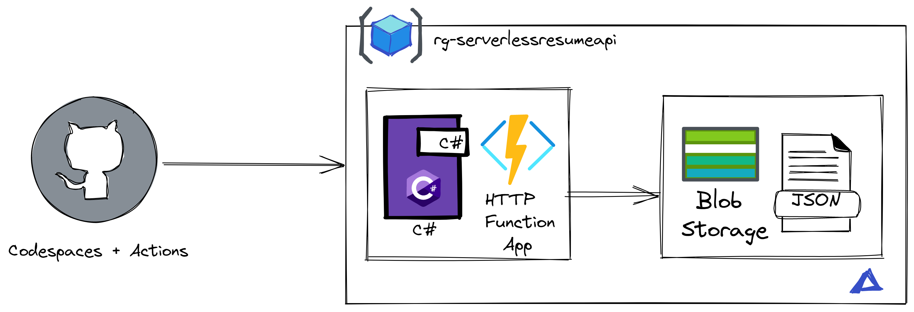

# Su API de currículum en Azure Serverless

Cree una [API](https://learn.microsoft.com/training/modules/build-api-azure-functions/3-overview-api) con Azure Function que muestre la información de su currículum en json.



- GitHub para control de versiones.
- [Acciones de GitHub](https://docs.github.com/en/actions) para CI/CD (ntegración continua).
- [Azure Functions](https://learn.microsoft.com/en-us/azure/azure-functions/functions-overview) para implementar nuestra API.
- Azure Blob Storage para almacenar nuestro currículum.
- .NET 6 como framework de programación para nuestra API.
- Opcional: [GitHub Codespaces](https://docs.github.com/en/codespaces/overview) como nuestro entorno de desarrollo.
- [Bicep](https://learn.microsoft.com/en-us/azure/azure-resource-manager/bicep/overview?tabs=bicep) para nuestra infraestructura como código.

## Necesitarás

- Cuenta Azure
- Cuenta GitHub
- Proporcioné un archivo .json de muestra basado en el [currículum de Json](https://jsonresume.org/schema/)

Para el entorno de desarrollo local

- VS Code
- Docker
- [Extensión de contenedor de desarrollo de VS Code] (https://code.visualstudio.com/docs/devcontainers/tutorials)

> **NOTA**
> Por el momento, GitHub Free para cuentas personales viene con 15 GB de almacenamiento de Codespaces y 120 horas Core por mes. Obtenga más información sobre [precios aquí] (https://docs.github.com/billing/managing-billing-for-github-codespaces/about-billing-for-github-codespaces)

## Cómo empezar

### Obtenga el código y el entorno

1. [Fork el repositorio](https://docs.github.com/pull-requests/collaborating-with-pull-requests/working-with-forks/about-forks) para que pueda tener su propia copia.
2. PARA CLOUDSPACES: Haga clic en el botón 'Code', haga clic en la pestaña 'Codespaces' y haga clic en 'Crear Codespaces en main'. Proporcioné un archivo [`devcontainer.json`](https://code.visualstudio.com/docs/devcontainers/create-dev-container) con la configuración necesaria para este proyecto.
3. Una vez que su Codespace se haya cargado, en el Explorador, expanda la carpeta `src` y cambie el nombre de `local.settings.sample.json` a `local.settings.json`
4. PARA DESARROLLADORES LOCALES: clone el código, ábralo con VS Code y ejecútelo en el contenedor de desarrollo. Más información [aquí](https://code.visualstudio.com/docs/devcontainers/containers)

### Autentique su entorno con Azure
1. En la Terminal, escriba `az login --use-device-code` para iniciar sesión en su cuenta de Azure desde az cli en su Codespace.
2. En la Terminal, escriba `az account list --output table` para obtener una lista de las suscripciones de Azure que tiene disponibles y tome nota del nombre que desea usar.
3. En la Terminal, escriba `az account set --name "name-of-subscription"` con el nombre de la suscripción que desea usar.
4. En la Terminal, escriba `az account show` y asegúrese de que esté configurado para la suscripción en la que desea trabajar.

### Aprovisionar recursos en Azure

> **NOTA:** He configurado el nombre del grupo de recursos para que sea `rg-serverlessresumeapi`

1. He proporcionado archivos de Infraestructura como Código (IaC), puede encontrarlos en la carpeta `infra`. Ahora necesitamos usar esos archivos para crear una implementación en Azure, en la Terminal, escriba:
    ```sh
    az deployment sub create --template-file ./infra/main.bicep -l <su-región>
    ```

2. En la Terminal, ejecute el siguiente comando para obtener los valores para el nombre de su cuenta de almacenamiento y el nombre de la aplicación de función:
    ```sh
    az deployment group show -g rg-serverlessresumeapi -n recursos --query properties.outputs
    ```
2. Cargue `myresume.json` en ese contenedor de blobs recién creado.
    ```sh
    az storage blob upload --account-name <nombre-de-la-cuenta-de-almacenamiento> --container-name resume --name myresume.json --file myresume.json
    ```
3. En su `local.settings.json` agregue la cadena de conexión de la cuenta de almacenamiento al valor `AzureWebJobsStorage`. Puede obtener ese valor ejecutando este comando:
    ```sh
    cuenta de almacenamiento az show-connection-string --name MyStorageAccount --resource-group rg-serverlessresumeapi
    ```
6. Ahora puede ejecutar y depurar (F5) su función en su entorno

## Configurar CI/CD con acciones de GitHub

1. Necesitaremos obtener el perfil de publicación de nuestra función, ejecutar:
    ```sh
    az functionapp deployment list-publishing-profiles --name {nombre de la función} --resource-group rg-serverlessresumeapi --xml
    ```
2. En su repositorio de GitHub, cree un secreto llamado `AZURE_FUNCTIONAPP_PUBLISH_PROFILE` con el contenido de su perfil de publicación.
3. Dirígete a la pestaña Acciones en tu repositorio y ejecuta manualmente el flujo de trabajo.
4. Una vez que esté completo. Visite Azure, seleccione grupos de recursos. busque rg-serverlessresumeapi y haga clic en la aplicación de función, luego haga clic en la URL, agregue getresume al final, se mostrará la información de su currículum.